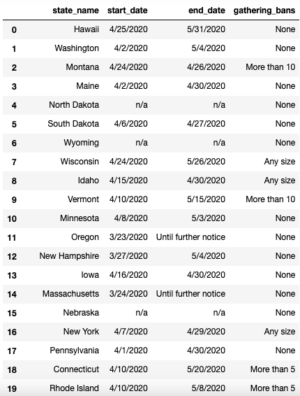
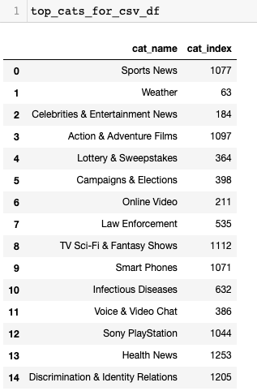
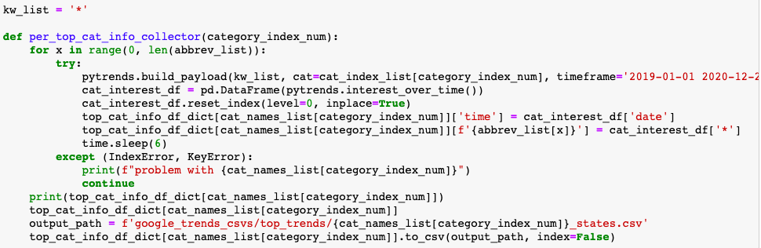
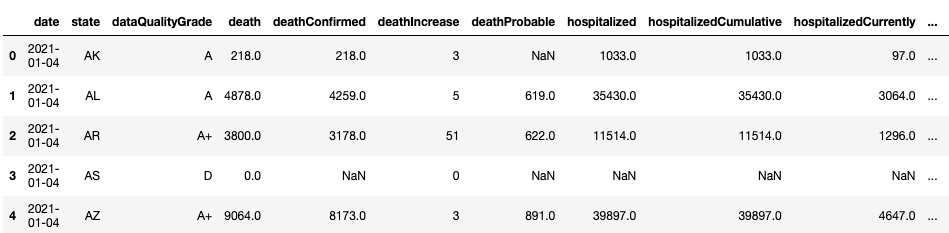
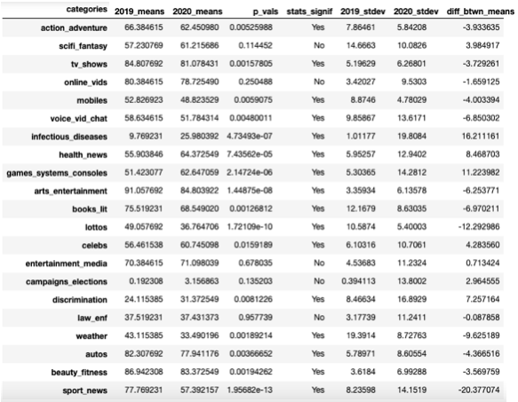
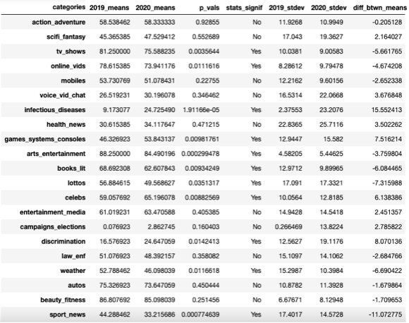

# Google Trends & Covid Data Analysis Project

# Look at the “final” folder to see our exemplary code. 
This folder contains our coding notebooks, input and output data folders, a presentation of our work, and a [writeup](/final/writeup.md) with our findings. Click into the folder for a more detailed file structuring.

Additionally, this repository contains folders with each group member's individual contributions. 

## Project Description

The aim of this project was to discover the effect Coronavirus stay-at-home orders had on Google searches by U.S. state. While there were several types of restrictions over the epidemic, stay-at-home order represented the most restrictive of these in the United States, and therefore would be most likely to impact people's behavour. We also noted whether each state had gathering orders at any point to add further detail. We used a selection of Google Trends categories over 2019 - 2020, accessed through the API [PyTrends](https://pypi.org/project/pytrends/), as a way to understand people's searching activity. It should be noted that the source of numerical values we used, PyTrends method Interest Over Time, along with Google Trends itself, does not show interest through numbers of searches but a rating from 0 to 100, where 100 is the highest interest in the time period requested, and 0 is the lowest. We chose to intake information on a weekly level, which was the most specific level the method provided, since we wanted to observe changes happening on the finest level we could. Two states, California and Wyoming, were chosen as a 'case study' (the reasons for choosing these two states are outlined in the [writeup](/final/writeup.md)), but data for all states were obtained. The stages of the project involved:
- Information Gathering:
    - Stay-at-home order information:
        - using the [ArcGIS Covid19 data API](https://services1.arcgis.com/s6aICfcOJecr58j6/ArcGIS/rest/services/Stay_at_Home_Orders_and_Advisories/FeatureServer) to obtain stay-at-home order data, cleaning it, and saving it to a CSV
        

          
        

    - Google search information:
        - using PyTrends Top Categories between 2018 and 2020 to discover the most searched for items over those years
        

          
        

        - assigning categories to each of those terms, removing duplicates, and arriving at 21 categories
        - using PyTrends Interest Over Time to derive weekly popularity ratings in each category
        

          
        

    - Covid Case information:
        - downloading and cleaning by-state information on Covid infections by week
        

          
        

    - Combining information into by-state CSVs:
        - dividing each category's data into CSVs for each state
        - adding true/false values to note whether a gathering ban or stay-at-home order was in force during each week
        

          
        

- Creating graphs:
    - grouping categories together for graphing purposes, getting the groupings Communication, Discrimination & Law, Election, General Entertainment, Health, Miscellaneous, Other Entertainment, TV & Film
    - finding standard deviations, and running p-tests for California and Wyoming (the case study states)
    ##### _California_
    

    
    

    #### _Wyoming_
    

    
    

    - using functions to run through all the CSVs and create graphs for:  1)2019 and 2)2020 separately, as well as 3)together, 4) means comparisons, and pie charts showing 5)the percentage each category/category grouping's mean took up in total searches and 6)category groupings by year

## Challenges/Conclusions
### Challenges
The greatest challenge was getting results back in a timely manner from the PyTrends API. Initially, our intent was to survey all 1000+ categories Google Trends had available. We hit request limits quickly, and then decided to use the Time library to space requests. Even with utilising Time, we still encountered request limits, but more importantly, while we were able to eventually derive CSVs from PyTrends, it took days to get data from one category. We therefore decided to re-focus, using PyTrends Top Trends to identify categories that would be important for 2019 and 2020 (2018 was included to see what could have been important early in 2019), ending up with 21 categories. We learned that correctly identifying the scope of a project is important to being able to complete even the first stages of data gathering. Doing a test stage of one category could have been a way of learning how many categories we would be able to process during the time we had. 

Another challenge was analysing the graphs once we had collected and shaped all the data. Once again, we learned that our scope was too large, and decided to identify two contrasting states we could use to provide insight into whether stay-at-home orders had an effect on search habits. We also decided to use means comparison graphs to make clearer where spikes in interest were actually statistically important. 

### Conclusions
Overall, the pandemic led to people being more interested in entertainment and health, most likely out of a need to occupy themselves/take their minds off external troubles and a desire to protect themselves. However, the stay-at-home orders did not seem to have a clear effect on people's search habits.

See the [writeup](/final/writeup.md) for more detailed conclusions.