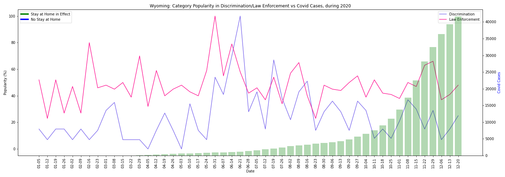
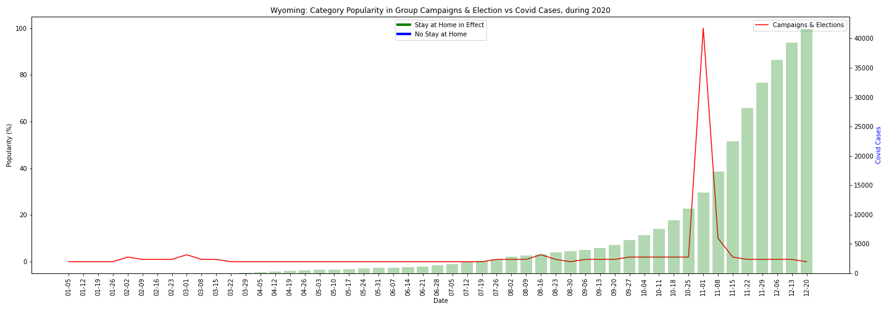
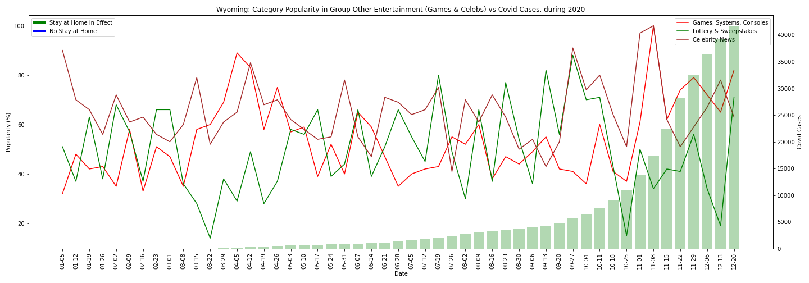
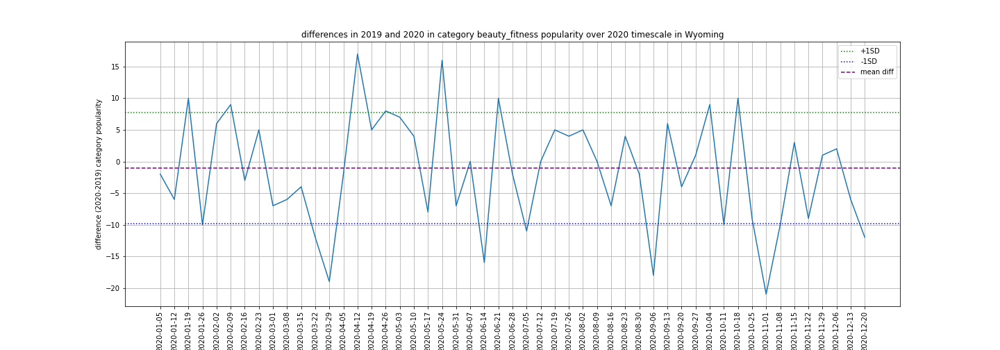

# Google Search Data vs Corona Virus Project Writeup:

Our questions were: 

1 - What effect has the coronavirus had over the last year on people’s top google searches? 

2 - Is there variation by locality?

Our working hypotheses/expectations were:

 1) The coronavirus had shifted people's google searches, where people would probably search more for entertainment, video online communication, and health information 

 2) A state with strong lockdowns would have more interest in entertainment, video online communication, and health information

We decided to focus on two states to make our comparisons: California and Wyoming. They have several opposing characteristics, which we were interested in drawing out. California is a coastal state, with a large population, and which implemented lockdown orders quickly and for a long duration. Wyoming is a mid-Western state with a smaller population, which did not implement a lockdown at all.

For each state, we looked at 21 categories, derived from Top Search data over the last three years (2018, 2019, 2020). We divided those categories into eight groups: tv/film, communications, discrimination/law enforcement, elections, general entertainment, games and celebrities entertainment, health, and miscellaneous.

## Question 1: What effect has the coronavirus had over the last year on people’s top google searches? 

### Top Level Answer, based on average search popularity differences between 2019 and 2020:

TV/Film: 3/4 categories _fell_ in interest for both states.

Communications: interest in mobiles stayed the same, while interest in voice/video chat _decreased_ in 2020 for both states

Discrimination/law enforcement: interest in discrimination rose for both states, while in law enforcement stayed the same for both states.

Elections: interest in elections stayed the same for both states between 2019 and 2020. 

General entertainment: Arts/Entertainment and Books/Literature dropped for both states, while interest in Entertainment Media _stayed the same_ for both states.

Games and celebrities entertainment: interest in games/consoles/systems and celebrity news rose for both states. Interest in lotteries/sweepstakes fell for both states.

Health: interest in Health News rose for California, but did not change for Wyoming. Interest in Infectious Diseases rose for both states.

Miscellaneous: Weather fell in interest for both states. Interest in Automobiles fell in California, but remained the same in Wyoming. Beauty/Fitness decreased in California, while it stayed the same in Wyoming. Interest in Sports News fell for both states.

### But it's more complicated...

These top level answers do not tell the whole story in some cases. Below explores each group of categories in more depth, especially where the average interest for each year hides some interesting trends. 

**TV/Film**

Three of the four (action/adventure, tv shows, online video) categories' average search popularity fell for both states, and sci-fi/fantasy's average popularity remained about the same. For sci-fi/fantasy, tv shows, and online video, dips in early November, perhaps connected to people turning their interest to the presidential election instead, drove down the averages. 

Looking at the graphs themselves, in California, search interest in sci-fi/fantasy, tv shows, and online videos grew during the early lockdown period, suggesting that these were some of people's chosen entertainments during early lockdown. 

In Wyoming, there is an odd spike in online video around late March-early April, when many states were going into lockdown, but Wyoming wasn't. 

  
  

**Communications**

In both states, search interest in mobiles stayed roughly the same as in 2019. This could be due to people being less concerned about buying new phones during a time where money was probably tighter, and there were other things to focus on.
Meanwhile, there was a fall in search interest in voice and video chat in 2020 for both states. This fall in average search interest hides a large spike in March-April in both states, which is then balanced by a fall in interest in both states towards the end of the year. The spike in interest makes sense in California, as more people would be using online video chat for work from home. However, it is unexplained in Wyoming, where no lockdown occurred.

  
  

**Discrimination/Law Enforcement**

There was a significant rise in search popularity for discrimination in 2020 for both states, compared to 2019, due to large spikes in interest in late May and late June. These rises were probably not caused by the pandemic, but rather the protests and controversies occuring around this time throughout the nation.
While the average search interest in law enforcement was insignificant for both states, there were also spikes in both states around the time of the protests in the summer. 

  
  

**Elections/Campaigns**

For both states, the difference between search popularity for campaigns/elections in 2019 and 2020 was insignificant, as many weeks in that time were close to 0% interest. However, this hides the large spike in interest in campaigns/elections during the week of the presidential election (the first week of November). 

  
  

**General Entertainment**

There is a significant drop in search popularity for arts/entertainment in 2020, compared to 2019 in both states. This is a broad category, including outside activities like going to the cinema, museums, and plays. Both states seem to have a slight 'summer lull' in interest in the category, with interest falling during roughly late May - August. Due to the broadness of this category, including both indoor and outdoor activities, it could be that specific searches popular in California are different from those in Wyoming, and relate more to indoor activities in California, and more to outdoor activities in the lockdown-free Wyoming.

In both states, there was a significant drop in search popularity in Books/Literature in 2020, compared to 2019. Both states appear to have a fairly large dip in interest during the summer months, as well as dips in early (during election week) and late November, which drew the average for the year down. In California, there was a sustained spike in interest in books/literature early June - late September, suggesting that as the lockdown wore on for a bit, people started turning towards books as a means of entertainment. 

The difference between search popularity for entertainment media in 2019 and 2020 was insignificant for both states, but this was due to a heavy drop in interest in it during early November (during the presidential election). There was actually a spike in interest in mid March-early May, covering the first few months of the lockdown for California, where people may have been looking into different forms of media (cds, dvds, books, etc.) where they could find entertainment. Wyoming also having a peak in entertainment media in mid-late March is odd, given that there was no lockdown during which people had more time for entertainment. However, the data in Wyoming is spiky, and there are several other peaks, so those early-pandemic peaks might not be very important. 

  
  

**Games and Celebrities entertainment:**

There was a significant rise in search popularity for games, consoles, and systems in 2020 compared to 2019 for both states. In both states, a big spike occurs in late March to early April, the start of the lockdown period for California. There are peaks towards the end of the year in both states as well, but those are similar to peaks in 2019, suggesting perhaps those are yearly peaks in interest perhaps for buying gifts for the holiday season. But during the March-April spike, video games were probably another form of entertainment people were potentially interested in engaging in during their newfound free time during the lockdown. The early-pandemic period rise in Wyoming data is strange, as there was no lockdown during this point, where one might think people might turn to video games for entertainment. Perhaps the rise in interest is due to people being stressed about the pandemic and turning to video games as an escape after work during this time. Or perhaps, while not required to by a state lockdown, some businesses sent their employees home during this period, and those employees used their time playing video games.

There was a significant drop in search popularity for lotteries and sweepstakes in 2020. In California, the interest is pretty flat and low for most of the year. This result could seem surprising, as the lotteries are a form of escapism, hoping to win large sums of money, which one might think people would want to do amidst the stress of the pandemic. However, in the early stages of the lockdown, people might not have had the mental space for dreaming of big monetary gains, but were instead focused on their immediate health, and plans for how to keep themselves well. In Wyoming, interest fluctuates over time, with big losses of interest in late March, when the pandemic stated, and in late October and mid December. The first loss of interest could be related to start of the rise of cases, but the other dips seem unrelated to the pandemic. 

There was a significant rise in search popularity for celebrity news in 2020, with large spikes in late September and early November (the week of the presidential election and the following week) in Californina, but fluctuating throughout the year in Wyoming. Perhaps by this time in the pandemic, people in California were starting to look outside themselves and their immediate social circle for interesting information. Furthermore, if the candidates are considered celebrities, the rise in attention to celebrity news could be due to overlap with the election/campaigns category. Conversely, celebrity news could have been a distraction for people if they were trying to escape from election information. Wyoming's interest in celebrities also rose in those late September and early November periods, perhaps for similar reasons, but it is harder to pick those spikes out amongst the general spikiness of the data. 

  
  

**Health**
There was a significant rise in search popularity for health news in 2020 in California only. There was a spike in interest in mid March-early April (when cases were starting to rise, and lockdown was starting), as well as a bigger spike in mid April-mid May (over the next few weeks of lockdown). There was also a decline in interest in late October-late November, as people may have grown comfortable with what they knew about health, and were no longer alert to it. In Wyoming, the average search interest in health news in 2020 did not significantly change compared to 2019. As is usual for the Wyoming data, it is more spiky than the California data, and while there are peaks in early March, mid April, and early-mid May, there is a lack of sustained interest the way there was in California. Health News is a broad category, however, and this result might be taken to suggest that the pandemic did not inspire people in Wyoming to look more into health in general, the way it seemed to have done in California.

By contrast, the average search interest in infectious diseases in 2020 significantly rose compared to 2019, for both states. Both states follow a similar trajectory: a peak from early March-mid April, and then remaining rather stagnant for the rest of the year. In both states, people seem to have been intensely interested in infectious diseases (most likely specifically coronavirus) towards the beginning of the pandemic, but then seem to feel they know enough about it, and stop looking into it as much. 

  
  

**Miscellaneous**

There was a significant drop in search interest for the category weather in 2020 for both years. For this grouping, comparison with 2019 is useful, as both states seem to still be fairly bumpy. But when looking at comparisons of differences between 2019 and 2020 data, for both states, it is possible to see falloff in interest in the autumn of 2020 (as well as a dip in interest in weather in February for California, which is likely unrelated to the pandemic). Both California and Wyoming are states with distinct seasons, with potentially harsh winters. It would make sense that if people are leaving the house, they would want to see how the weather affects their journey. In California, this lack of interest makes sense because of the ongoing lockdown. The drop in interest in Wyoming suggests that even though there wasn't a lockdown, people might have been travelling less, and were thus less concerned about weather affecting their journeys.

There is a significant drop in search popularity for automobiles in 2020, compared to 2019 for California only. The main drops occur mid-late March, when lockdown started, and where cases started rising - a lot of people were probably staying home and not thinking too much about their vehicles. There was a gentle swell of interest from early April to mid October, perhaps when people might have started to grow stir-crazy, and want to think more about leaving the house. Meanwhile, there was no significant average change in the search popularity for automobiles in Wyoming, remaining high throughout the year, especially in the summer months, suggesting that, as there was no lockdown, people continued to care about their vehicles. 

There is a significant drop in search popularity for beauty/fitness in 2020, compared to 2019 in California only. Interest in the category remained fairly low throughout the year, with a peak of interest in late August, when the lockdown had been going for a while, and summer might have inspired people to turn towards their appearances. Oddly, there was also a peak in early April, in the third week of lockdown, perhaps when people were still trying to return to old routines. In Wyoming, by contrast, there was no significant difference between average search interest in beauty/fitness between 2020 and 2019. Interest stayed at a moderate level throughout the year, with spikes in September and October. It seems that, since there was no lockdown, people continued to care about their appearances about as much as in the previous year. 

There was a significant fall in search interest for sports news in 2020 compared to 2019 for both states. In California, large falls in interest occurred around the start of the lockdown (late March, early April), and also during the summer (early May to July). In Wyoming, the fall was more consistent, through late March - late July. One might think people might have wanted to escape into watching sports during the early pandemic, but perhaps this drop was more to a dimishishment in supply: fewer sports competitions were held, especially during the earlier part of the pandemic.

  
  

### Election Effect

Several categories had dips in interest during the first week of November, during the presidential election. These dips are sometimes hard to see clearly just using 2020 data, but looking at graphs which show the difference between the popularity of a category in 2020 and the popularity in 2019, it is easy to see deep dips in interest during that specific week. Those deep dips show that many people across the two states found this election very important, and turned from their usual interests to focus on the election. 

This election effect can be seen in the categories: books/literature, beauty/fitness, celebrity news, online video, entertainment media, sci-fi/fantasy (California only), tv shows (California only).

One example graph is shown here. The others can be found in the ca_wy_graphs in the output_graphs folder.

  
  

## Question 2: Is there variation by location in the way the pandemic affected states?

For several categories, both states behaved the same. These categories include: action/adventure, tv shows, online video, sci-fi/fantasy (all in the group TV/Video), mobiles, voice/video chat (all in the Communications group), Discrimination, Law Enforcement, Elections/Campaigns, Arts/Entertainment, Books/Literature, Entertainment Media (all in General Entertainment), Games/Systems/Consoles, Lotteries/Sweepstakes, Celebrity News, Infectious Diseases, Weather, and Sports News

Some of these similarities are surprising: one might expect activities relating to entertainment (tv shows, online video, sci-fi/fantasy, Arts/Entertainment, Books/Literature, Entertainment Media, Games/Systems/Consoles, Lotteries/Sweepstakes, Celebrity News) to be unchanged for a state where there is no lockdown, and thus no extra free time. However, Wyoming showed spikes in all of these categories, in the same way as California did. Perhaps these spikes in Wyoming show a greater desire for escapism, so people are searching for those categories after work. Additionally, although a lockdown was not required, perhaps some employers did send employees home nonetheless, allowing those employees to have more free time to search for those categories. 

A few categories differ between the states: Health News, Automobiles, Beauty/Fitness

It makes sense that these categories differ, relating to the different pandemic response of each state. For Wyoming, interest in autombiles and beauty/fitness stayed the same in 2020 because people were still more able to do outside activities and see more people. The fact that California implemented strong stay at home protocols and Wyoming didn't suggests that California may generally be more concerned with health, and Wyoming isn't, aligning with California's interest in health news rising, and Wyoming's interest staying the same. 

## Conclusions:

We were generally correct in our predictions: under lockdown, people tended to search more about entertainment, voice/video chat, and health. But Wyoming, our non-lockdown state, often had rises and falls in interests in tandem with our lockdown state, California, even though there was no lockdown in Wyoming. This could be another avenue in research: despite the lockdown order, did may businesses send their employees home? Was there still a rise in working from home during different periods in Wyoming?

Differences in states occurred less than we had expected, especially since the states we chose were so different. The few categories that did differ, Health News, Automobiles, Beauty/Fitness, differed in reasonable ways, relating to the greater freedom of movement and association in Wyoming. 

A surprise was how much the election affected interests in other categories. Searches within the election category were pretty limited to the week of the election itself, but although the interest was limitied, during the week of the election, there was a deep dip in interest in several categories. From the election graphs alone, one might not guess that the 2020 presidential election mattered very much to people, but as seen from the other graphs, it seemed to change people's search behavior dramatically for that week.

A limitation of our study is that we assumed that 2019 was a good average year to measure 2020 against. Future research could involve looking at more years past, and perhaps averaging them, to get a better understanding of how 2020 changed people's behavior.

More/different categories could also have been used to uncover more information on how people's searches changed. 

